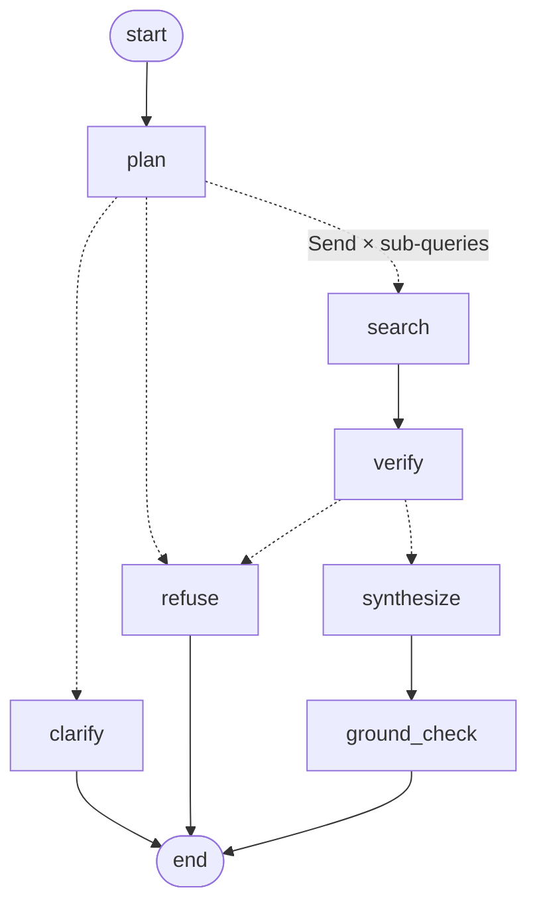

# Agentic RAG over US & UK tax documents

A small, cited, guarded question-answering system over four official tax documents: IRS
Publication 17 for 2023 and 2024, and the gov.uk income tax rates pages for 2023-24 and
2024-25. You ask a question, and a planner breaks it into sub-queries. The years in those
sub-queries come from a deterministic resolver. Search agents run one per sub-query, check
their own evidence and retry once with a rewrite when it's wrong. An answer is written only
from what they found, and every figure in it is checked against the passage cited for it.
Ambiguous questions get one clarifying question. Advice and years outside the corpus are
refused.

It runs on CPU and on Groq's free tier, and it costs nothing. The control flow was written
by hand first (`agents/runner.py`), in the shape of a LangGraph graph, and then ported to
LangGraph (`agents/graph.py`) without changing a node. Both orchestrators are kept, selected
by `ORCHESTRATOR`, and on replayed LLM output they return identical state for every gold
question. See [Framework migration](#framework-migration-langgraph).

---

## Quickstart

You need [uv](https://docs.astral.sh/uv/) and a free Groq API key from
[console.groq.com](https://console.groq.com). uv installs Python 3.11 itself if you don't
have it.

```bash
git clone https://github.com/SrijaniDas-GitHub/agentic-tax-rag.git && cd agentic-tax-rag && uv sync
```

```bash
uv run python -m ingest.build_index
```

```bash
uv run streamlit run app/main.py
```

```bash
uv run python -m pytest -q
```

**Before step 3**, copy `.env.example` to `.env` and put your key in it:
`GROQ_API_KEY=gsk_...`. Everything else in that file is optional and already has the
default shown. Steps 1, 2 and 4 don't need a key: the tests use a fake LLM client and never
touch the network.

What each step costs on a fresh machine (measured from a clean clone on Windows, CPU only;
see *Notes on a fresh clone* below):

- `uv sync` installs CPU PyTorch, sentence-transformers, Chroma and Streamlit. That's the
  slow step, about two minutes on a warm uv cache and longer on a cold one.
- `build_index` downloads `BAAI/bge-small-en-v1.5` (about 130 MB) into `.hf_cache/` inside
  the repo. Then it embeds the 227 committed chunks into Chroma and builds a BM25 index next
  to it. The source PDFs are **not** needed: `data/chunks.jsonl` is committed, so the corpus
  comes with the clone.
- The app pays a one-time warm-up (embedding model plus both indexes, 15 to 20 s) on first
  load, and the sidebar shows how long it took.

With `make` (see the [Makefile](Makefile)), the same four commands are `make sync`,
`make index`, `make app` and `make test`. `make` isn't needed for anything. Windows doesn't
ship it, and every target is one `uv run` line you can type instead.

### The LLM cache, and what it means for your first clicks

Every completion is cached on disk in `data/.llm_cache/`, keyed on the exact request. That
directory is **gitignored**, so a fresh clone has an empty cache. **Every button you click
on a fresh clone is a cold turn that spends real tokens**: about 2k for a clarification or
a refusal, 6k for a single lookup, and up to 14k for the retry example (q06). Clicking all
five example buttons once costs about 35k tokens. Clicking a button a second time replays it
from the cache in well under a second and spends nothing.

That matters because of the free tier's limits (see *Limitations*): 8000 tokens per minute
per model, and 200k tokens per day per key. Click the buttons one at a time and let each
answer finish. Two cold turns in the same minute will spend the second one waiting on the
rate limit.

After an answered turn, the next turn's planner prompt includes what that turn carried (see
*Carried context* below). So an example button clicked *after* another answer is a
different request from the same button clicked first, and it won't replay from the cache.
Click **Clear conversation** in the sidebar before each example button if you want repeat
clicks to cost nothing.

### Notes on a fresh clone

Measured by cloning the repo into an empty directory on Windows 11 (CPU only, 15 GB RAM)
and running steps 1, 2 and 4 with no `.env` and no key:

| step | time | notes |
|---|---|---|
| clone + `uv sync` | 2 min 18 s | uv's package cache was already warm on this machine. On a machine that has never downloaded CPU PyTorch, expect a few minutes more |
| `build_index` | 1 min 52 s | includes downloading the embedding model. Embedding the 227 chunks is ~100 s of that |
| `pytest -q` | 34 s | all tests pass |

That's under five minutes from `git clone` to a green test suite. Nothing outside the repo
was needed, and no file in the clone was modified by the build.

A second fresh clone, with a real key in `.env`, an empty `data/.llm_cache` and its own
`.hf_cache`, was timed from `git clone` to the app answering:

| step | elapsed since `git clone` | notes |
|---|---|---|
| clone + `uv sync` | 23 s | uv's package cache was warm |
| `build_index` | 2 min 52 s | includes downloading the embedding model into the clone's own `.hf_cache` |
| app started | not stamped | started straight after `build_index`. The sidebar reported a 17.5 s warm-up |
| **first answered button (q01, cold)** | **4 min 20 s** | $14,600, p.96, 5,889 tokens |
| all five buttons, cold, one at a time | 11 min 27 s | includes ~2 min 40 s of waiting between turns for the per-minute limit, and the automation's own overhead |

The five cold turns spent 32,441 tokens (q01 5,889, q06 13,968, q07 8,144, q10 1,983,
q11 2,457). **Four of the five gave the scored behaviour.** q11 asked which tax year
instead of refusing the advice question. q07 answered (see *What you can ask*). Both are the
planner's run-to-run variance, described in *Limitations*.

### Make targets and their plain equivalents

| `make` | without make | what it does |
|---|---|---|
| `make sync` | `uv sync` | install the pinned environment from `uv.lock` |
| `make index` | `uv run python -m ingest.build_index` | build Chroma + BM25 from `data/chunks.jsonl` |
| `make app` | `uv run streamlit run app/main.py` | the chat UI, with the trace panel |
| `make test` | `uv run python -m pytest -q` | the test suite: no key, no network |
| `make eval` | `uv run python -m eval.run_eval --label baseline` | the 12-question eval, **cold: 65k to 74k tokens, about a third of a free key's day** |
| `make followups` | `uv run python -m eval.run_eval --followups` | the two-turn follow-up eval, ~12k tokens cold |
| `make retrieval` | `uv run python -m eval.retrieval_eval` | retrieval only, gold sub-queries, no LLM, free |
| `make report` | `uv run python -m eval.run_eval --report-only` | re-render `eval/report.md` from saved results, free |
| `make parity` | `uv run python -m eval.parity` | every gold question through **both** orchestrators from the LLM cache, full state diffed. Free: it swaps in a dummy key, so a cache miss errors instead of spending |

There's also a CLI, if you want one turn without the UI:
`uv run python -m agents.run "What is the 2024 standard deduction for a single filer?" --trace`.

---

## What you can ask

Five intent types. The app has one example button for each, and each button is a gold
question from the eval, so what you click is what was scored.

| intent | example | what should happen |
|---|---|---|
| `lookup` | *What is the 2024 standard deduction for a single filer?* | $14,600, cited to Pub 17 (2024) p.96 |
| `compare_years` | *Did the top tax bracket percentage for a single person change between 2023 and 2024?* | 37% in both years. Both search agents fail attempt 1 and recover on the rewrite |
| `compare_countries` | *How does the US standard deduction for a single filer compare with the UK Personal Allowance for 2024?* | $14,600 against £12,570, one filtered search per country. The `graph_cold` and `langchain_cold` runs answered it this way. The `baseline` run **refused** it, because the planner left the US leg without a year. A leg like that now takes the question's one year, with a note saying so (see *Limitations*) |
| `needs_clarification` | *I earn £50,000 a year - which tax band am I in for 2024-25?* | one question back: Scotland or the rest of the UK? |
| `out_of_scope` | *Should I take the standard deduction or itemise?* | refuses the recommendation and offers the figures. That's what every scored run did. One cold run on a fresh clone asked which tax year instead (see *Limitations*) |

Follow-ups inherit context: after the lookup above, *"and what about 2023?"* answers $13,850
for the US, without asking which country.

---

## Architecture

```
  question  (+ carried from the last answered turn: its question and resolved filters)
      │
      ▼
  [plan]  LLM → DraftPlan: intent, sub-queries, each with the year AS TYPED
      │     • re-plans once if it asked "Scotland or the rest of the UK?" of a
      │       question that already named the region
      │   resolve_plan → core.year_resolver   (pure function, no LLM)
      │     • year_text → tax_year_key, checked against the corpus
      │     • a year the corpus doesn't hold → refuse, reason year_not_in_corpus
      │
      ├── needs_clarification ──► [clarify] ──► END    exactly one question
      ├── out_of_scope ─────────► [refuse]  ──► END    advice / year not held / other
      │
      ▼
  [fan_out]  one concurrent branch per sub-query
      │
      │   ┌─ [search]  the search agent, at most 2 attempts ─────────────────┐
      │   │  attempt 1: the planner's sub-query, as written                  │
      │   │    retrieve with a HARD filter on (country, tax_year_key):       │
      │   │    dense (Chroma, bge-small) + BM25 → reciprocal rank fusion     │
      │   │    → top 8                                                       │
      │   │    sufficiency self-check (LLM, on the second model)             │
      │   │  insufficient → rewrite, using what the failed pack contained    │
      │   │  attempt 2 → EvidencePack (sufficient, or the reason it isn't)   │
      │   └──────────────────────────────────────────────────────────────────┘
      ▼
  [verify]  deterministic: drop off-target passages, count the sufficient legs
      │
      ├── no leg sufficient ──► [refuse] ──► END    says what's missing
      │
      ▼
  [synthesize]  LLM → claims, each citing the chunk_ids it uses
      ▼
  [ground_check]  deterministic: every number against the passages ITS claim cites
      ▼
     END  → answer, citations, grounding report, trace
            carry() → what the next turn inherits
```

The bracketed names are the real node names in `agents/nodes.py`. The routing between them
is two pure functions in `agents/routing.py` that return node names. `agents/runner.py`
calls the nodes in order and merges their partial updates with the reducers declared in
`agents/state.py`. That's the part a graph framework replaces, and it's kept small for that
reason. `agents/graph.py` is that replacement ([below](#framework-migration-langgraph)).

**Two agents, with separate jobs.** The orchestrator decomposes the question, verifies
coverage, synthesizes and guards. The search agent owns retrieval, and it's the part that
can change its mind. Neither one wraps the other. For a workload that's only ever single-hop,
one agent would be better, because the second costs round trips.

**The planner** makes one LLM call and returns a `DraftPlan`, with an intent and a list of
sub-queries. Each sub-query has a country and the year *as the user wrote it* (`year_text`).
The model never sees a `tax_year_key` field, so it can't fill one in. The re-plan is a
single, bounded second call. It happens only when the draft asks which UK region the user
means about a question that already names one. If the model asks again, that answer stands.

**The year resolver** (`core/year_resolver.py`) turns `"2024"`, `"2024-25"`, `"FY24-25"`,
`"AY 2025-26"`, `"last year"` and similar into a key: the calendar year the tax year *starts
in*. The resolver implements four conventions: US calendar year, UK April to April,
Australian July to June, and India's FY/AY pair. The corpus holds only the first two. The
Australian and Indian branches are tested against a corpus that doesn't contain them, so
adding a country is a manifest entry rather than code. When a planner refuses on coverage
without producing sub-queries, the resolver is also run over the user's question itself.
That way the refusal reason is `year_not_in_corpus` because code established it, not
because a sentence in the model's output happened to say so.

**The search agent** (`agents/search_agent.py`) doesn't rewrite on attempt 1. The planner
already produced a retrieval-shaped query, and a speculative rewrite in front of every search
would cost a call per branch while hiding the failures that matter. Attempt 2 rewrites *with
evidence*: it can see the query that failed, why the self-check rejected it, and the passages
that came back instead. Those passages are from the right document, so they're the best
available source of that document's vocabulary. Gold question q06 is built around this.
Users say "tax bracket percentage" and Pub 17 says "Tax Rate Schedules", so attempt 1 misses
on both years and the rewrite recovers both gold pages. Every search carries both filters.
The filter isn't there for recall. It's there so that the evidence pack can't contain a
plausible wrong answer from another country or year.

**Verify** is deterministic. It drops any passage whose country or year doesn't match its
own sub-query (this should always be zero; it's a safety check). Then it counts which legs
came back sufficient. If none did, the turn is refused and the refusal names what's
missing. The answer isn't filled in from model memory. A comparison with one leg missing is
still answered, and the synthesizer is told which leg is missing.

**Synthesis and numeric grounding.** The synthesizer returns claims, and each claim cites
chunk ids. `guardrails/numeric_grounding.py` then checks every number in every claim
against the passages *that claim* cites, and nothing wider. `29,200` in this corpus is the
2024 married-filing-jointly standard deduction, and also a 2023 filing threshold, and also
an age-adjusted table amount. A check against the whole evidence pack would pass a wrong
answer with a real citation attached. Numbers are normalized before comparison (`$14,600`,
`14,600` and `14600` are one value). Percentages must match as percentages. Years, tax-year
labels and page references are whitelisted because they're never tax figures. A figure
that fails is marked in the answer and reported by kind, not silently dropped:
`derived_arithmetic` means the model added or subtracted two cited numbers, and
`invented_figure` means nothing cited produces it. The grounding report is shown in the
trace panel.

**The two exits.** Clarification asks exactly one question. For q10, that has to be the
question that changes the answer (Scotland's bands differ from the rest of the UK's), not
a question about the year. Refusal is a planner *intent* routed to its own node, not a
disclaimer added to an answer. Refusals carry a reason, such as `personalised_advice` (it
declines the recommendation and offers the figures), `year_not_in_corpus` (it names what it
does hold), or `insufficient_evidence` (it says what's missing).

**Carried context** (`agents/carry.py`). After an answered turn, the next turn's planner
gets that turn's resolved `(country, tax_year)` filters *and its question*, labelled as
context and not something to plan again. A clarification carries nothing. A refusal
carries nothing either, even though an advice refusal still has sub-queries. Otherwise the
next turn would inherit filters from a question the system declined to answer.

**The trace panel.** Everything in it is read from the final state, and nothing is
recomputed in the UI. That includes the plan with each year's resolver provenance, every
search attempt with its rewrite and self-check verdict, all eight retrieved chunk ids with
their scores, the grounding report, per-node timings, and the model and token count on
every LLM call.

---

## Design decisions, and what was turned down

**Four documents and two countries, not nine documents and four.** The goal was to show
that the design handles different tax-year conventions, and two conventions that disagree
about what "2024" means (US calendar year, UK 2024-25) do that. More documents would have
cost days of downloading, trimming and checking tables for no new design evidence. The
resolver already has tested branches for Australia and India, so a third country is a
manifest entry. The time saved went into the grounding guardrail, the node tests and the
eval.

**Years come from the resolver, never from the model.** Asked for "the tax year key of
2024-25", a model returns 2025 often enough to matter, and it doesn't say it was unsure.
The key is what joins a user's words to the vector store's filter, so one wrong key
answers a different year fluently and with citations. The planner's output schema has no
field for it.

**Rules that matter are enforced in code, not only in the prompt.** The first complete eval
run found the planner breaking two rules its own prompt states. It asked about Scotland in
a question that already said Scotland, and it refused an out-of-corpus year with its own
wording instead of emitting the sub-query the resolver would have caught. Groq at
temperature 0 isn't deterministic (below), so a rule that exists only in a prompt is
followed most of the time, and "most of the time" shows up in the metrics. Both now have
deterministic backstops: the bounded re-plan, and the resolver-backed refusal reason. The
prompts are unchanged. In the `baseline` run, q12 refused with `year_not_in_corpus` and
the reason check was 4/4, but filter precision **failed** at 0.875 on a third slip of the
same kind: on q07 the planner left one leg's year empty. That now has a third backstop: a
leg with no year takes the year the question names, but only when it names exactly one
(see *Limitations*). The `graph_cold` run was the first in which the q05 re-plan fired
live: the first draft asked *"Scotland specifically, or … the rest of the UK?"*, the
re-plan answered it, and q05 scored. q07 didn't slip on that run, so its backstop hasn't
fired live yet.

**One retry policy, owned by this code.** Early in the eval, a single-branch lookup took
1 hour 59 minutes to return a correct answer. Nothing was broken in the agents. The Groq
SDK's default retries were stacked under this project's own retry and its JSON-repair retry,
each attempt able to wait out a 60-second read timeout, with rate-limit sleeps in between:
4 × 3 × 2 attempts. The SDK's retries are now off, requests carry an explicit timeout, and
the single remaining policy honours the provider's `retry-after` and is visible in the
trace. A test pins the SDK setting.

**Follow-ups carry the previous question, not only the filters.** The first version carried
only the resolved filters, so that the planner wouldn't get a second question to decompose.
An early live follow-up, *"and what about 2023?"*, came back asking which country. A
fragment has no subject, `{"countries": ["US"]}` doesn't say what was asked, and the
prompt's "no country, so clarify" rule won. Now the previous question is carried, labelled
as context only. The prompt also says a fragment inherits the subject, and that a carried
country or year counts as stated. With nothing carried, the prompt is unchanged.

**Hybrid retrieval, and no reranker.** After the hard metadata prefilter, each search is
over roughly twenty chunks, and reranking a pool that small isn't where the gains are. Dense
and hybrid retrieval were measured against each other instead, and the numbers are below.
They're a narrower win for hybrid than you might expect.

**`diversify_by_page` is implemented, measured, and left off.** US table pages appear twice
in the index: once as extracted table markdown, and once inside the page's prose text. So
about a third of each evidence pack is a page that's already there. Collapsing to one chunk
per page raises recall in isolation. But the copy it drops is the prose copy, and that's the
one that carries the qualifiers the table leaves out ("but not more than the regular standard
deduction amount"). The end-to-end comparison looked like a clear win in aggregate. On
inspection, the entire gap came from one question the flag can't reach, because the planner
decides whether to clarify before retrieval runs. Like for like, the two runs were identical
on everything the eval measures. No gold question exercises a prose-only qualifier, so the
risk can't be measured yet, and with no measured gain the default stays off.

**Deterministic metrics, and no LLM judge.** At n=12, an unvalidated LLM judge adds variance
without adding information. Every metric here is exact-match or set membership: resolved
filters against expected filters, retrieved pages against gold pages, expected figures as
substrings, the grounding check, and which node ended the turn. A judge would also use the
same 8000-token-per-minute budget as the system under test. Judge-based groundedness is the
next step, *alongside* a larger gold set and not instead of these metrics. The substring
metric has already been caught being wrong once (see *Limitations*).

**Groq only, behind an interface.** `core/llm.py` is an `LLMClient` with the cache, a
concurrency limit and the single retry policy. A local backend would be configuration,
but with no GPU it wasn't worth it. Groq meters each model separately, so the per-branch
sufficiency check runs on a second, smaller model (`gpt-oss-20b`) and planning and
synthesis run on `gpt-oss-120b`. That split was measured before it was adopted. On six real
evidence packs, both models parsed 6/6 and agreed on 5/6 verdicts, and on the sixth the
smaller model was right. It took a three-branch query from 41 s to 6.9 s with identical
output. `ALLOW_FAST_MODEL=0` undoes it.

**LangChain inside the client, not around it.** The prompt files render through
`ChatPromptTemplate`, and the call is `ChatGroq.with_structured_output(schema,
method="json_mode", include_raw=True)`. The JSON→Pydantic parse and the one repair retry
were written by hand first. `with_structured_output` replaced the parse, not the repair:
it reports a parse failure and never asks the model again, so the repair turn, the cache
and the retry policy still wrap the chain. The request and the cache keys didn't change, so
`make parity` stayed 13/13 identical.

**Hand-written first, framework second.** The control flow is written by hand so that it's
fully understood before it's delegated. The code follows a few rules that make it
graph-shaped: one state type with declared reducers, nodes that return partial updates,
routing as pure functions, and fan-out isolated in one function. That turns the LangGraph
port into wiring. Both orchestrators stay, selectable with `ORCHESTRATOR`, and they produce
the same state on the same model output. The next section is what that port looked like.

---

## Framework migration: LangGraph

**What changed.** One file added, `agents/graph.py` (~100 lines). `nodes.py`, `routing.py`,
`state.py` and `runner.py` were untouched by the port. The CLI, the eval and the app pick an
orchestrator through one function, `agents.run.select_runner`, which reads `ORCHESTRATOR`
and rejects anything but `runner` or `graph`.

| hand-written (`runner.py`) | LangGraph (`graph.py`) |
|---|---|
| an `if/elif` over `route_after_plan` / `route_after_verify` | `add_conditional_edges`, passing **the same two functions** |
| `fan_out`: `asyncio.gather` over `search_node`, then a merge loop | `fan_out` returns `[Send("search", {"sub_query": sq}) ...]` |
| `apply`: a `REDUCERS` dict applied by hand | the `Annotated[..., operator.add]` metadata on `AgentState` |

`Send` is the one new concept. `route_after_plan` still returns the string `"fan_out"`, and
the graph turns that answer into one `Send` per sub-query. Each carries a `SearchState`,
which is exactly what `search_node` already took, so the send target needed no adapter. The
branches run in one superstep, and `verify` runs once, after all of them. By then the
reducers have merged `evidence`, `trace` and `timings` in dispatch order, not arrival order.



Generated by `graph().get_graph().draw_mermaid()`. The `Send` label was added by hand. Dotted
edges are conditional.

**How it was checked.** A cold eval can't prove a port, because two cold runs of the *same*
code already disagree (q07 refused in the `baseline` run and answered in a fresh-clone run).
So `make parity` takes the model out of the comparison. It replays every gold question and
the follow-up through both orchestrators from the LLM cache, with a dummy API key, and diffs
the **whole** final state: plan, evidence packs, verification, draft, grounding report,
answer, citations and every trace row. Before the diff it drops timings, and the runner's
`fan_out` trace row, which the graph has no node for.

| `make parity` | at the port, cache from the `baseline` run | final code, cache mostly from the `langchain_cold` run |
|---|---|---|
| **turns with identical state, runner vs graph** | **13 / 13**, 0 errored | **13 / 13**, 0 errored |
| filter precision (both) | 0.875 | 1.000 |
| recall@8 (both) | 1.000 | 1.000 |
| answer contains (both) | 0.875 | 1.000 |
| grounding violations (both) | 0 | 0 |
| behavioural (both) | 4 / 4 | 4 / 4 |
| tokens spent | 0 | 0 |

The first row is the result that matters. The metric rows score whatever completions the
cache holds, and a cold run rewrites every entry it touches: they read 0.875 while the
cache held the `baseline` run's q07 refusal, and 1.000 after later cold runs replaced it.
What matters is that runner and graph agree on every row either way. The measured numbers
are under *Evaluation*.

The replay covers only the paths the cache holds. The current cache drew clean plans for q05
and q07, so the q05 re-plan and the q07 blank-year path aren't replayed under the graph.
`tests/test_nodes.py` and `tests/test_planner.py` cover them. `tests/test_graph.py` checks
runner/graph equality offline on the answer, clarify and refuse-after-verify paths, and it
fails if the fan-out's order is reversed.

Cached-turn wall clock was measured once, at the port (36 turns each): a median of 35.2 ms
under the runner and 37.5 ms under the graph. `make parity` doesn't time turns.

**What LangGraph bought.**
- Routing is declared, and the graph can draw itself. The diagram above is generated from
  the running code, so it can't drift from it.
- Fan-out and merge are handled by the framework. `runner.fan_out` and `runner.apply` are
  the two functions the graph doesn't need.
- A checkpointer is one argument to `compile()`. Multi-turn memory currently goes through
  `carry()`, and it could move there. That hasn't been done.

**What it cost.**
- A dependency: `langgraph` 1.2 and `langchain-core`, 17 new packages in `uv.lock`, and
  **~1.3 s** of import time the first time the graph is used in a process. Per turn, the
  extra cost is in the noise (35.2 vs 37.5 ms median per cached turn, above).
- One timing is lost. The fan-out is an edge, not a function, so there's nothing to put a
  timer around. The graph's trace has no `fan_out_ms`. Each branch's `search[...]_ms` is still
  there.
- A new way to fail. A channel that two branches write without a reducer makes LangGraph
  raise `InvalidUpdateError` at run time, not at compile time. `state.py` declared its
  reducers before the port, so the port didn't hit this. A test reproduces it on purpose.
- The stack trace gets deeper. A failure inside a node now surfaces through Pregel's task
  runner, not directly from `runner.run`.

**The LLM client.** `core/llm.py` moved to `ChatGroq.with_structured_output` behind a
`ChatPromptTemplate` (see *LangChain inside the client, not around it*). It replaced the
parse, not the repair. The messages sent and the cache keys didn't change, so the parity
replay above still holds (13/13), and the `langchain_cold` run scored what `graph_cold` did
(*Evaluation*).

---

## Retrieval: dense vs hybrid

Measured by `eval/retrieval_eval.py`, which uses no LLM. It takes the 12 gold questions'
hand-written sub-queries (12 answerable sub-queries in total) and asks whether at least one
gold page appears in the top k. These numbers measure retrieval in isolation.

| mode | metadata filter | recall@1 | recall@4 | recall@8 | MRR | off-target passages |
|---|---|---|---|---|---|---|
| **hybrid** (dense + BM25, RRF) | on | 0.333 | **0.833** | **0.833** | 0.549 | 0.0% |
| dense only | on | 0.417 | 0.667 | **0.833** | 0.519 | 0.0% |
| BM25 only | on | 0.417 | 0.833 | 0.833 | 0.597 | 0.0% |
| hybrid | **off** | 0.333 | 0.750 | 0.833 | 0.514 | **45.8%** |
| hybrid, one chunk per page | on | 0.333 | 0.833 | 0.917 | 0.566 | 0.0% |

Two of the twelve sub-queries (both halves of q06) are *designed* to miss on the first
attempt, so 0.833 means 10/12 with both designed misses counted.

What this shows, and what it doesn't:

- **At k=8, dense and hybrid tie.** After the prefilter, the candidate pool is about 20
  chunks, and k=8 is a third of it. At that ratio almost anything finds the gold page, so
  recall@8 measures the corpus more than the retriever. They also miss *different* questions
  at that tie.
- **The difference is one cutoff earlier: recall@4 is 0.833 for hybrid and 0.667 for dense
  only.** Hybrid gets the gold page into the first four slots for two more sub-queries out of
  twelve. Exact figures and the documents' own terms ("Schedule X") are where BM25 helps.
- **BM25 alone has the best MRR**, and that row stays in the table. At n=12, a 0.05 MRR gap is
  one sub-query moving two places. That doesn't show the embedding model is unnecessary. It
  shows n=12 can't settle the question.
- **The metadata filter isn't for recall. It's for purity.** Turning it off barely changes
  recall, but 45.8% of the returned passages then come from a country or year that wasn't
  asked about. An unfiltered US tax-bracket question returns the Scottish top rate at rank 1.

---

## Evaluation

`eval/gold_set.jsonl` has 12 questions: 4 lookups, 2 cross-year comparisons, 2 cross-country
comparisons, 2 that must be clarified and 2 that must be refused. `eval/run_eval.py` runs
each one end to end through the orchestrator `ORCHESTRATOR` selects, first cold (cache reads
off) and then replayed from the cache. It paces itself against the rate limit *between*
questions, so no measured turn includes waiting on the provider. All metrics are
deterministic. `eval/report.md` has the per-question detail, and `eval/results/` has the raw
results for each run.

Three full cold runs on Groq's free tier: `baseline` is the hand-written runner,
`graph_cold` is the LangGraph orchestrator (which also includes the blank-year fix), and
`langchain_cold` is the same graph with `core/llm.py` on LangChain.

| metric | definition | `baseline`, runner | `graph_cold`, graph | `langchain_cold`, graph + LangChain | target |
|---|---|---|---|---|---|
| filter precision | dispatched `(country, tax_year_key)` pairs equal the expected ones | **0.875, FAIL** (7/8: q07 refused, see *Limitations*) | **1.000** | 1.000 | ≥ 0.9 |
| recall@8 | at least one gold page retrieved, per dispatched sub-query, final pack | 1.000 | 1.000 | 1.000 | ≥ 0.8 |
| answer contains | every expected figure appears in the answer | 0.875 | 1.000 | 1.000 | ≥ 0.8 |
| grounding violations | numbers in the answer not in the passage cited for them | 0 of 58 checked | 0 of 57 checked | 0 of 54 checked | 0 |
| behavioural accuracy | correct clarify/refuse on the 4 behavioural questions | 4/4 | 4/4 | 4/4 | 4/4 |
| …with the right reason | refusal reason and clarifying topic also correct (stricter, reported separately) | 4/4 | 4/4 | 4/4 | 4/4 |
| p50 latency, cold | wall-clock per question, cache cold | 2.5 s (max 16.9 s) | 2.8 s (max 12.7 s) | 2.9 s (max 8.6 s) | < 15 s |

**Read the second column as one more draw, not as an improvement.** The whole difference
is q07. It refused in `baseline` because the planner left the US leg's year empty. In
`graph_cold` the planner filled both years itself, so the blank-year fix didn't fire and
didn't earn the 1.000. The graph can't have earned it either: on the same model output the
two orchestrators return identical state (see *Framework migration*). What the second run
does show is that the graph holds up on a live, paced, cold run: 12 of 12 questions, every
figure grounded, and the q05 re-plan firing for the first time.

**The third column checks the LangChain client change: same numbers.** Every scored metric
matches `graph_cold`. It's still one draw. Of the run's 35 model calls, 21 returned the same
parsed output as in `graph_cold`. The rest changed wording (q03, q04, q06) or, on q05,
drafted the right plan first time so the re-plan wasn't needed. No question's tokens per
model rose by more than 77, and a repair turn re-sends the whole prompt, so the repair
didn't fire more often than before.

**The budget is met per turn, not per minute.** The free tier meters 8000 tokens per minute
per model. A three-branch turn costs up to ~14k tokens split across the two models, so two
cold turns don't fit in one minute. The eval therefore paced itself for 263 s
between questions, outside every measured turn. The p50 is what one turn costs on a rested
rate-limit bucket. It isn't a throughput figure: a user sending questions back to back will
see backoff. A cached replay of the same questions has a p50 of 0.08 s.

The cold pass spent 65,470 tokens in total in `baseline`, 73,826 in `graph_cold` and 71,361
in `langchain_cold`. Most of the 8,356 difference between the first two is q07 answering
instead of refusing (+5,834). q05's re-plan, one extra planner call, adds +2,175, and its
absence in `langchain_cold` is most of that run's −2,465.

### What the agentic part is worth

Two harnesses score the same gold pages with different sub-query text. The difference
between them separates what the planner contributes from what the retry loop contributes.

| harness | sub-query text | recall@8 |
|---|---|---|
| `retrieval_eval.py` | hand-written gold sub-queries | 0.833 |
| `run_eval.py`, attempt 1 | the planner's own sub-queries, first try | 0.800 |
| `run_eval.py`, final pack | the planner's own, after at most two attempts | 1.000 |

Row 2 minus row 1 is the planner. Row 3 minus row 2 is the retry loop. In this run, 3 of 10
sub-queries went to a second attempt, and 2 of those recovered a gold page that attempt 1
had missed. Filters are compared as resolved `(country, tax_year_key)` pairs and never as
question text, because the model's wording changes from run to run while the routed filter
doesn't.

### Follow-ups

`eval/followups.jsonl` is kept separate from the twelve. Its one row runs q01 (the 2024 US
standard deduction), applies the app's own `carry()`, and then asks *"and what about
2023?"*. Only the second turn is scored.

| f01, turn 2 | expected | result |
|---|---|---|
| filters | US 2023 | US 2023, ok |
| answer contains | $13,850 | $13,850, ok |

One row is a regression check for one bug, not a rate.

---

## Limitations

- **Rate limits are the binding constraint.** A free Groq key gets **8000 tokens per minute
  per model** and **200,000 tokens per day**. A cold run of the 12-question eval costs 65k
  to 74k tokens (three runs), a third of the day, so a fresh key can run it about twice a
  day and still have some left for the UI. The daily limit isn't reported in the response
  headers, so nothing client-side can pace against it. It shows up only as an error once
  it's used up, and it refills at about 139 tokens a minute. The eval stops cleanly when that
  happens and reports unrun questions as *not measured* rather than *failed*.
- **Groq isn't reproducible at temperature 0.** The same question can decompose differently
  on two runs. In one pair of runs an hour apart, the planner clarified a question once and
  answered it the next time. The eval compares routed filters rather than text for this
  reason. It also means any single run's numbers can move by a question in either direction.
  The deterministic backstops described above target three known cases (q12, q05 and q07).
  Two have held in measured runs (q12 in all three, and q05 once in `graph_cold`). q07's
  hasn't fired yet. They don't remove the variance.
- **The substring metric can pass a wrong answer.** In one run, q08 (US vs England top rate)
  passed *answer contains* for the wrong reason. The planner wrote the UK leg as "the UK"
  instead of "England". The answer said England's rate "is not specified" and cited
  Scotland's 45% advanced rate, and `45%` was the expected substring. A reader would mark it
  wrong. That's the clearest argument for adding a judge alongside these metrics.
- **No gold question tests prose-only qualifiers.** Some caveats exist only in the prose copy
  of a US table page. The eval can't see whether an answer keeps them, which is why
  `diversify_by_page` stays off.
- **n=12 is a smoke test.** It catches regressions, which is what it's for. It can't separate
  retrievers at k=8, and it can't support confidence intervals.
- **Two countries, four documents**: US tax years 2023 and 2024 (Pub 17), UK 2023-24 and
  2024-25 (gov.uk rates and allowances). Anything else is refused. Pub 17 is a general guide,
  so questions that need a specialist publication will come back insufficient.
- **A fresh clone starts with an empty cache**, so every click costs tokens until it has
  been asked once (see *Quickstart*).
- **Open items:**
  - Filter precision was **0.875 against a target of 0.9, a FAIL**, in the `baseline` run.
    It was 1.000 in `graph_cold` and `langchain_cold`, for the reason given under
    *Evaluation*. In `baseline`, q07 refused before retrieval: the planner attached "2024"
    to the UK leg and left the US leg's year empty, and the resolver refuses an empty year
    rather than guessing one. **Fixed in code since, but not yet exercised live.** A leg
    with no year now takes the question's year when the question names exactly one, and its
    note says so. That's checked by counting distinct years, because the resolver reads
    "from 2023 to 2024" as a single UK span. With two years named, the leg still refuses.
    Unit tests run on the recorded planner output. **All three cold q07 runs since have
    answered without the planner slipping** (the `q07_fix` spot check and the full
    `graph_cold` and `langchain_cold` runs), so the fix hasn't fired live yet.
  - The q05 re-plan guard **fired live** in the `graph_cold` run, handling a region
    clarification of a question that names Scotland. That's one firing, not a rate.
  - In a cold run of the five buttons on a fresh clone, **q11 asked which tax year**
    (`needs_clarification`) instead of refusing the advice question. q07 **answered**
    ($14,600 against £12,570, grounded 5/5), with its own note assuming the US year. Both
    are planner draws, not code changes. The same gold question can come back differently on
    the same code.

---

## With more time

- **An LLM judge alongside a larger gold set.** A judge scoring groundedness and
  correctness, validated against hand labels on 30 to 50 questions, would catch cases like
  q08 that substring matching passes. It should be added alongside the deterministic metrics,
  not instead of them.
- **A qualifier gold question**: one whose correct answer needs the prose copy's "but not
  more than the regular standard deduction amount". That's the missing measurement behind the
  `diversify_by_page` decision.
- **Revisit `diversify_by_page`** once that question exists. It frees about a third of each
  evidence pack for other pages, and currently that change moves nothing the eval measures.
- **More follow-up rows**, so carried context is measured as a rate instead of checked on
  one example.

---

## Configuration

All optional except the key. `.env` is gitignored, and `.env.example` documents each value.

| variable | default | what it does |
|---|---|---|
| `GROQ_API_KEY` | none (required to ask questions) | your Groq key |
| `MODEL_NAME` | `openai/gpt-oss-120b` | planner and synthesizer |
| `FAST_MODEL_NAME` | `openai/gpt-oss-20b` | the per-branch sufficiency self-check |
| `ALLOW_FAST_MODEL` | `1` | `0` puts the self-check back on `MODEL_NAME` (one rate-limit bucket, slower) |
| `LLM_CACHE` | `1` | `0` disables cache *reads*. Writes stay on, so a cold pass refills the cache |
| `DIVERSIFY_BY_PAGE` | `0` | `1` collapses each pack to one chunk per page (see above) |
| `ORCHESTRATOR` | `runner` | `graph` runs the same nodes in LangGraph (`agents/graph.py`). Anything else is an error |
| `HF_HOME` | `./.hf_cache` | where the embedding model is downloaded. An existing value wins |

## Repository layout

```
agents/      nodes, routing, runner + graph (the two orchestrators), search agent, planner, carry, prompts/
core/        year_resolver, retrieval (hybrid + RRF), embedding, BM25, LLM client
guardrails/  numeric_grounding
ingest/      download → parse → chunk → build_index  (only build_index is needed)
app/         the Streamlit UI and trace panel
eval/        gold_set.jsonl, followups.jsonl, run_eval.py, parity.py, retrieval_eval.py, report.md, results/
data/        manifest.yaml, chunks.jsonl (committed); chroma/, bm25.pkl, .llm_cache/ (built locally)
tests/       unit tests for every node, router, the resolver and the guardrail
```
